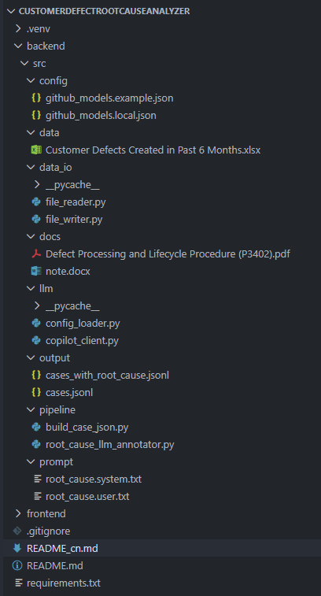

# Customer Defect Root Cause 自动化分析系统

## 1. 项目背景

在企业级产品交付与客户支持过程中，客户会通过 **Salesforce / Azure DevOps (ADO)** 持续提交大量 Defect 工单。每条 Defect 往往包含：

- 工单基础信息（如 Title、Product、Priority、Area 等）
- 多轮反复沟通记录（Comments）
- 缺陷复现步骤（Steps to Repro）

传统流程中，需要依赖人工逐条阅读这些信息，再进行 **Root Cause（根因）分析**与**分类（Type / Subtype）**并回写到 ADO。该方式存在明显问题：

- 人力成本高
- 周期长、难以规模化
- 不同人员判断标准不一致

本项目旨在通过 **LLM（Copilot / GPT 类模型）+ Prompt 工程 + 自动化流水线**，实现对大量 Defect 的批量 Root Cause 生成与分类，并支持后续人工 Review 与规则增强迭代，最终将结果回写到 ADO，形成可持续优化的闭环。

---

## 2. 系统目标

- **自动化生成**：为每条 Defect 生成 Root Cause 描述
- **结构化分类**：给出 Root Cause Type 与 Subtype（严格基于官方/内部文档定义）
- **批量处理**：支持流水线式处理大量 Defect（如 1 万条级别）
- **可审计、可迭代**：支持人工 Review、Prompt 优化与 Rule Engine 辅助
- **闭环回写**：将最终结果通过 API 回写至 Azure DevOps

---

## 3. 端到端流程概览（Pipeline）

### Step 1：提取并结构化 Defect 数据

系统从 Azure DevOps 中导出或汇总 Defect 数据（常见形式为 Excel / 表格），通常包含三类信息：

1. **主表（每行一个 WorkItem）**包含 Defect 的核心字段，例如：

   - Title
   - Customer Name
   - Defect Type
   - Priority
   - Area / Family / Product / Subarea
2. **Comments 表（多行对应一个 WorkItem）**包含客户与支持团队之间的多轮沟通信息，可附带作者与时间戳。
3. **Repro Steps 表（多行对应一个 WorkItem）**
   包含缺陷复现或回溯步骤。

这些信息会被整合为“**每个 WorkItem 一条结构化记录**”，作为后续 LLM 推理的输入。

---

### Step 2：将官方分类定义注入 Prompt

Root Cause 的 Type / Subtype 并非自由生成，而必须遵循 ADO 或内部 Defect 分类规范。

系统会将以下内容统一注入 Prompt：

- 单条 Defect 的完整上下文信息（字段 + comments + repro steps）
- Root Cause Type / Subtype 的官方定义说明（来自 `docs/` 中的流程文档、PDF、内部截图等）
- 明确的输出格式约束（JSON，仅允许指定字段）

目标是确保 LLM 的输出**可控、可解释、可回写**。

---

### Step 3：LLM 推理与结构化输出

LLM 会针对每条 Defect 生成：

- `root_cause`：根因描述（自然语言）
- `root_cause_type`：根因大类
- `root_cause_subtype`：根因子类

输出结果以 **JSONL / JSON** 文件形式保存，且**不会覆盖原始输入文件**，以保证可追溯性。

为控制 token 成本并提高稳定性，系统支持对以下内容进行可配置的预处理：

- 限制最多保留的 comments 数量
- 限制单条 comment / repro step 的最大字符数
- 限制最多输入的 repro steps 数量

若个别样本推理失败，系统会保留原记录并附带错误信息，不影响整批任务继续执行。

---

### Step 4：人工 Review + Prompt / Rule Engine 迭代（Human-in-the-loop）

系统引入人工 Review 作为质量保障的一部分：

- 按 Product / Feature 抽样 Review
- 判断 Root Cause 及 Type / Subtype 是否合理
- 总结常见错误模式

基于 Review 结果，可持续进行以下优化：

- Prompt 结构与约束优化
- 补充或细化分类文档说明
- 引入 **Rule Engine** 对确定性较强的场景进行辅助判断，与 LLM 形成“规则 + AI”的混合决策机制

---

### Step 5：回写到 Azure DevOps（闭环）

当输出质量达到预期后：

- 通过 Azure DevOps API
- 将 Root Cause / Type / Subtype 写回对应的 Defect 工单字段
- 实现从数据提取到结果回写的全流程自动化闭环

---

## 4. 项目目录提示（非代码细节版）

- `docs/`Root Cause 分类规范、Defect 生命周期说明等文档（Prompt 重要输入来源）
- `backend/src/prompt/`System Prompt 与 User Prompt 模板
- `backend/src/output/`中间与最终产物（如 cases.jsonl、cases_with_root_cause.jsonl），通常不纳入版本管理
- `backend/src/pipeline/`
  数据构建、LLM 标注等流水线步骤

### 项目目录结构（快速浏览）

## 5. 输入 / 输出数据格式示例（简化版）

### 输入示例（单条 Case）

{
  "work_item_id": 1551759,
  "fields": {
    "Title": "RPL Wizard failure, again",
    "Customer Name": "Merck",
    "Defect Type": "Does Not Work As Designed",
    "Priority": "To be set at Review",
    "Area": "Recipe Management",
    "Family": "Chemical MES",
    "Product": "Aspen Production Execution Manager",
    "Subarea": null
  },
  "comment": [
    {
      "text": "Wizard failed after FMIX MR was created.",
      "created_date": "2025-08-04T15:06:37.293Z",
      "modified_date": "2025-08-04T15:06:37.293Z",
      "author": "Dupont, Eric"
    }
  ],
  "repro_steps": [
    "Open RPL Wizard",
    "Create FMIX MR",
    "Wizard fails immediately"
  ],
  "root_cause": null,
  "root_cause_type": null,
  "root_cause_subtype": null
}

### 输出示例（LLM 标注后）

{
  "work_item_id": 1551759,
  "root_cause": "The wizard fails due to missing validation handling after FMIX MR creation.",
  "root_cause_type": "Product Defect",
  "root_cause_subtype": "Workflow / State Management"
}

## 6. 运行方式（3 行命令级别）

在项目根目录执行：

pip install -r requirements.txt
python backend/src/pipeline/build_case_json.py
python backend/src/pipeline/root_cause_llm_annotator.py

运行完成后，结果将生成在：

backend/src/output/
├── cases.jsonl
├── cases_with_root_cause.jsonl

## 7. 效率与价值总结

通过流水线化处理与 AI 辅助分析：

* 大幅减少人工逐条阅读与分类的成本
* 提升 Root Cause 分类的一致性
* 支持大规模 Defect 的快速处理
* 将“多人多周”的工作压缩为“少量 Review + 数天到两周”的周期（视数据复杂度而定）

## 8. 后续规划

* 持续优化 Prompt 与分类准确率
* 引入更完善的 Rule Engine 与校验机制
* 支持增量处理与断点续跑
* 加强回写前后的审计与统计分析能力
